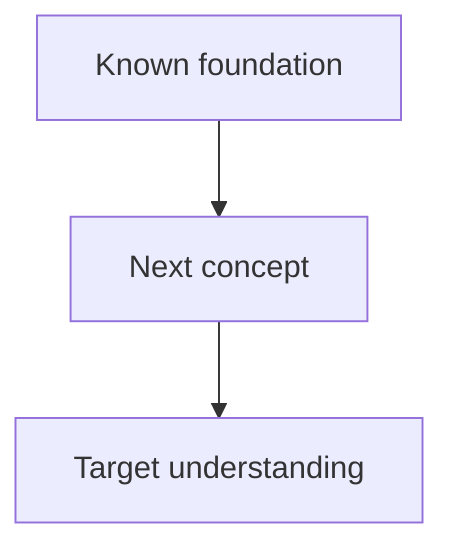

# {{title}}

## 1. Learning goal

**What I want to be able to do by the end:**

- 

**Why I need this:**

- 

---

## 2. Tutor contract

The AI tutor must:

1. Probe my current understanding before teaching.
2. Build from the deepest prerequisites I actually need.
3. Prefer sources in this order:
   - peer-reviewed papers / primary research;
   - textbooks and monographs;
   - official scientific or institutional documentation;
   - reputable university/course material;
   - high-quality educational websites;
   - YouTube only as a supplemental teaching resource, not as sole evidence for scientific claims.
4. Verify uncertain facts before presenting them as true.
5. Cite sources beside important claims.
6. Give page, section, equation, figure, or video timestamp when available.
7. Explicitly label:
   - **Established fact**
   - **Model assumption**
   - **Interpretation**
   - **Open question**
   - **Speculation**
8. For mathematics:
   - motivate why the object/formula is needed;
   - derive it from known ideas when practical;
   - check units/dimensions when relevant;
   - test limiting or simple cases;
   - connect the math to physical/statistical meaning.
9. Teach one dependency node at a time.
10. Quiz me before assuming a concept has landed.
11. Do not silently convert an AI explanation into one of my permanent notes.
12. End by asking me to restate the core idea in my own words.

---

## 3. Prerequisite probe

### Things I already understand

- 

### Things I partly understand

- 

### Things I do not understand yet

- 

### Misconceptions discovered

- 

---

## 4. Dependency map

---

## 5. Source set

| Source | Type | Why trusted | What it is used for | Location |
|---|---|---|---|---|
|  | Paper / Book / Official / Web / Video |  |  | DOI / URL / page / timestamp |

### Source conflicts / uncertainties

- 

---

## 6. Lesson log

### Node 1 — 

**Why we need it**

**Explanation / derivation**

**Connection to what I already know**

**Check**

- [ ] I can explain it without notes.
- [ ] I can derive/reconstruct it.
- [ ] I can use it in a new example.

### Node 2 — 

---

## 7. Questions I asked

- 

## 8. Mistakes that were useful

- 

---

## 9. Retrieval quiz

### Recall

1. 

### Explain why

1. 

### Derive

1. 

### Transfer to a new situation

1. 

### Code / compute

1. 

---

## 10. My explanation

Write this **without copying the tutor**.

> 

---

## 11. What is now solid?

- 

## 12. What is still unclear?

- 

## 13. Next learning node

- [[ ]]

## 14. Promote to permanent notes

- [ ] [[Concept - ]]
- [ ] [[Derivation - ]]
- [ ] [[Quiz - ]]

---

## Live transcript

