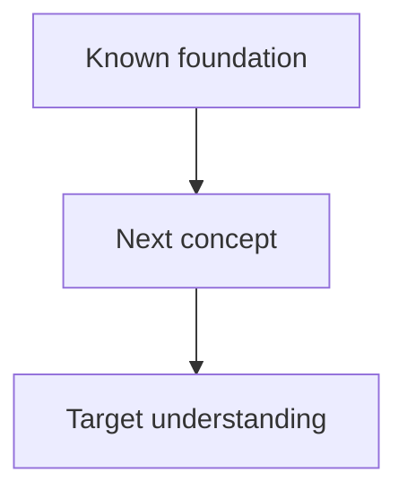

# {{title}}

> [!info] Tutor status: **LISTENING**
> Write your answer in the answer slot, then **tick the `Send this answer` checkbox**
> underneath it. That is what wakes the tutor — there is no timer, so think for as long as
> you want before ticking. The reply and the next question appear in this note.
>
> To pause or redirect, say so in chat.

## How to use this note

1. Scroll to **§3** and find the question marked `ACTIVE`.
2. Write inside the `**My answer:**` block underneath it.
3. **Tick the `Send this answer` checkbox.** The tutor responds when submission is detected.
4. The assessment and the next `ACTIVE` question appear below.
5. Say "I don't know" or "I recognise this but can't derive it" freely — that is a more
   useful signal than a guess, and it is what the probe phase is for.

---

## 1. Learning goal

**What I want to be able to do by the end:**

- 

**Why I need this:**

- 

---

## 2. Tutor contract

Follow the canonical `LEARNING_PROTOCOL.md` for preparation, probe budget, MCQ
quality, retention evidence, and promotion. Prepare before the live loop; record
the assessment after the block. `learning_refs` lists the working records' IDs.

The AI tutor must:

1. Probe my current understanding before teaching.
2. Build from the deepest prerequisites I actually need.
3. Prefer sources in this order:
   - peer-reviewed papers / primary research;
   - textbooks and monographs;
   - official scientific or institutional documentation;
   - reputable university/course material;
   - high-quality educational websites;
   - YouTube only as a supplemental teaching resource, not as sole evidence for scientific claims.
4. Verify uncertain facts before presenting them as true.
5. Cite sources beside important claims.
6. Give page, section, equation, figure, or video timestamp when available.
7. Explicitly label:
   - **Established fact**
   - **Model assumption**
   - **Interpretation**
   - **Open question**
   - **Speculation**
8. For mathematics:
   - motivate why the object/formula is needed;
   - derive it from known ideas when practical;
   - check units/dimensions when relevant;
   - test limiting or simple cases;
   - connect the math to physical/statistical meaning.
9. Teach one dependency node at a time.
10. Quiz me before assuming a concept has landed.
11. Do not silently convert an AI explanation into one of my permanent notes.
12. End by asking me to restate the core idea in my own words.

Use the narrow concepts needed for this task. Establish general understanding,
check it on an independent example, then apply it to the project. A project example
may help explain, but should not be the only explanation. Check uncertain evidence
before reteaching and skip established dimensions. Follow `TUTOR_PLANNING.md`
without turning the progression into a rigid script.

---

## 3. Prerequisite probe

Questions are posted here **one at a time**, newest last. Exactly one carries `ACTIVE`.

Pattern for each question — the tutor appends this, the learner fills the answer slot and
ticks the box:

```markdown
### Qn — <short topic> — `ACTIVE`

<one diagnostic question; do not hide extra questions in multipart prompts>

**My answer:**

>

- [ ] **Send this answer**
```

After the answer is submitted the tutor rewrites `ACTIVE` to `ANSWERED`, appends a
short verdict/hint (for example, `Correct.` or `Partially correct. Hint: ...`),
and posts the next question with a fresh unticked checkbox. Clear the old submission
marker. Defer detailed analysis, source lookup, and map/log updates until block end.
Give a minimal correction or pause for teaching/verification if continuation is
blocked, prepared evidence is insufficient, or the learner requests explanation.
Multiple choice is encouraged when it reduces typing or tests intuition.

At block end synthesize understood/partly understood concepts, misconceptions,
corrections, connections, and reinforcement needed before progression.

### Live questions


### Things I already understand

- 

### Things I partly understand

- 

### Things I do not understand yet

- 

### Misconceptions discovered

- 

---

## 4. Dependency map


```mermaid
graph TD
    A[Known foundation] --> B[Next concept]
    B --> C[Target understanding]
```

---

## 5. Source set

| Source | Type | Why trusted | What it is used for | Location |
|---|---|---|---|---|
|  | Paper / Book / Official / Web / Video |  |  | DOI / URL / page / timestamp |

### Source conflicts / uncertainties

- 

---

## 6. Lesson log

### Node 1 — 

**Why we need it**

**Explanation / derivation**

Start with the general concept and an intuitive model. Include formal treatment,
assumptions and limits when needed.

**Connection to what I already know**

**Independent example / transfer check**

**Project application, when relevant**

**Check**

- [ ] I can explain it without notes.
- [ ] I can derive/reconstruct it.
- [ ] I can use it in a new example.

### Node 2 — 

---

## 7. Questions I asked

- 

## 8. Mistakes that were useful

- 

---

## 9. Retrieval quiz

### Recall

1. 

### Explain why

1. 

### Derive

1. 

### Transfer to a new situation

1. 

### Code / compute

1. 

---

## 10. My explanation

Write this **without copying the tutor**.

> 

---

## 11. Demonstration and retention evidence

**What I reconstructed in this learning period:**

-

**Delayed retrieval outcomes, if any / assistance used:**

-

**Working learning records updated / attempt links / next review and rationale:**

-

Record summaries after the block; preserve the actual answers above. A same-session
success is not delayed retention, and an overdue review is not proven forgetting.
Keep conceptual, independent transfer and project application outcomes separate.
For schema-2 working records preserve scope, tested dimension and exact project/block
context when applicable; project success is not transfer evidence.

## 12. What is still unclear?

- 

## 13. Next learning node

- [[ ]]

## 14. Promote to permanent notes

Only after I explain the idea in my own words, answer a retrieval question, and
choose promotion. A working quizbook record can exist before this choice.

- [ ] [[Concept - ]]
- [ ] [[Derivation - ]]
- [ ] [[Quiz - ]]

---

## Live transcript

_Oldest first. **Append** new entries at the bottom — never prepend. Times approximate to the
minute._

