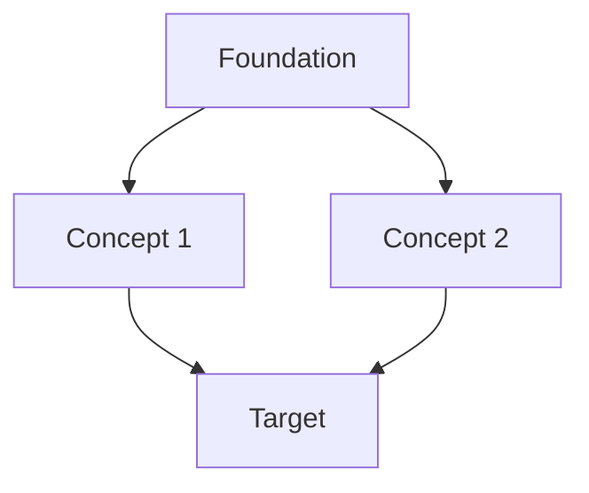

# {{title}}

## Target capability

By the end I want to be able to:

-

## Dependency graph

## Nodes

| Node | Why needed | Current state | Note |
|---|---|---|---|
|  |  | unknown / learning / solid | [[ ]] |

## Recommended source path

### Primary / authoritative
1. 

### Textbook / review
1. 

### Teaching resource
1. 

### Video supplement
1. 

## Milestones

- [ ] Can explain the foundations.
- [ ] Can derive the central equations.
- [ ] Can solve a toy example.
- [ ] Can implement the concept.
- [ ] Can connect it to current research.

## Open questions

-
