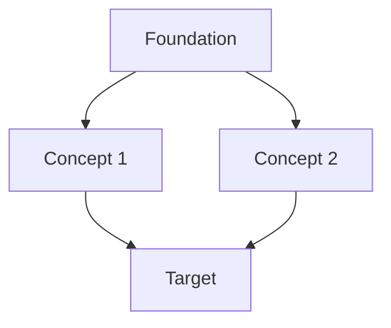

# {{title}}

## Target capability

By the end I want to be able to:

-

## Dependency graph

Planning sketch only. Arrows mean required prerequisite → dependent capability;
ordinary backlinks do not establish a dependency or mastery.

```mermaid
graph TD
    A[Foundation] --> B[Concept 1]
    A --> C[Concept 2]
    B --> D[Target]
    C --> D
```

## Nodes

| Learning ID | Why needed | Evidence-backed state / as-of date | Learning record |
|---|---|---|---|
|  |  |  | [[ ]] |

Use `unknown`, `learning`, `demonstrated`, `retained`, `fragile`, or `stale`
according to `LEARNING_PROTOCOL.md`. This table is a view of working records, not
another state ledger. Missing recent evidence is not proven forgetting.

## Frontier and reinforcement

**Ready next nodes / prerequisite evidence:**

-

**Fragile or stale prerequisites to check:**

-

**Beyond-frontier nodes / unmet prerequisites:**

-

Frontier is derived from prerequisite readiness, not a learning-state value.
Use `13_Knowledge_Graph.md` for a subject-wide or project-wide evidence view.

## Recommended source path

### Primary / authoritative
1. 

### Textbook / review
1. 

### Teaching resource
1. 

### Video supplement
1. 

## Milestones

- [ ] Can explain the foundations.
- [ ] Can derive the central equations.
- [ ] Can solve a toy example.
- [ ] Can implement the concept.
- [ ] Can connect it to current research.

## Open questions

-
